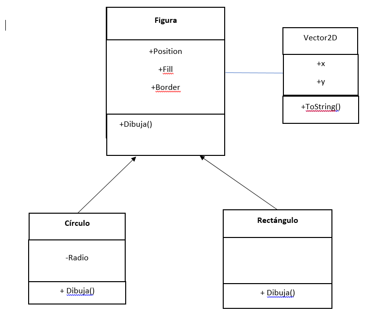

**Define: Clase Base, Clase Derivada.**

Clase base: La clase que tendrá todos o la mayoria de los elementos que se van a utilizar, ya que esta contendrá los parámetros más básicos de los objetos que vayamos a crear.

Clase Derivada: Este tipo de clases pueden agarrar (heredar) los parámetros que tiene la clase base para no tener que estarlos inicializando en cada clase.

**Haz un diagrama UML donde se muestre la relación de herencia entre las  clases Figura, Rectángulo y Círculo como vimos en clase.**

**Indica cuales son las clases base y las derivadas.**

La clase base es Figura con asociacion con vector2d
las clases deribadas son Circulo y Rectangulo implementando el método y parámetros de la clase base(Figura)

**¿Que es herencia simple y herencia múltiple? ¿En c# se puede hacer herencia múltiple?**

La herencia simple es cuando hay relación entre una clase base y clases derivadas de esa única clase base.

La herencia Múltiple es cuando las clases derivadas pueden agarrar parámetros de mas de una clase base, ya sean 2 clases bases o más.

NO se puede hacer herencia multiple en C#.

**Escribe el programa de Figura como vimos en clase, donde agregues varios tipos de figuras a una lista y recorre la lista llamando a un metodo de las figuras, además :
 Se sobrecarguen los constructores y se acceda a los constructores de la clase base 
Explica para que nos sirve la palabra base
 Haz el método Dibuja() que sea virtual y redefinelo en solo una de las clases derivadas.** 

     using System;
     using System.Collections.Generic;

      namespace Figura2
     {
    class Vector2d
    {
        public int x, y;
        public Vector2d(int x, int y)
        {
            this.x = x; this.y = y;
        }
        public override string ToString()
        {
            return String.Format("{0},{1}", x, y);
        }
    }
    class Figura
    {
        public Vector2d position;
        public string fill, border;

        //Constructor por defecto 
        public Figura() : this(new Vector2d(100, 100))
        {

        }
        //constructor de figura
        public Figura(Vector2d pos)
        {
            position = pos;
            fill = "white";
            border = "black";
        }

        public virtual void Dibuja()
        {
            
        }

    }

    class Circulo : Figura
    {
        private int radio;
        public Circulo(Vector2d pos, int radio) : base(pos)
        {
            this.radio = radio;
        }
        public Circulo() : base()
        {
            this.radio = 10;
        }

        public override void Dibuja()
        {
            Console.WriteLine("Se dibuja un circulo en {0} de color {1}", position, fill);
        }
    }

    class Rectangulo : Figura
    {

        public Rectangulo(Vector2d pos) : base(pos)
        {

        }
        public Rectangulo() : base()
        {

        }

        public override void Dibuja()
        {
            Console.WriteLine("Se dibuja un Rectangulo en {0} de color {1}", position, fill);
        }
    }

    class Cuadrado : Figura
    {

        public Cuadrado(Vector2d pos) : base(pos)
        {

        }
        public Cuadrado() : base()
        {

        }

        public override void Dibuja()
        {
            Console.WriteLine("Se dibuja un Cuadrado en {0} de color {1}", position, fill);
        }
    }

    class Rombo : Figura
    {

        public Rombo(Vector2d pos) : base(pos)
        {

        }
        public Rombo() : base()
        {

        }

        public override void Dibuja()
        {
            Console.WriteLine("Se dibuja un Rombo en {0} de color {1}", position, fill);
        }
    }

    class Program
    {
        static void Main(string[] args)
        {

            List<Figura> figuras = new List<Figura>();
            figuras.Add(new Circulo());
            figuras.Add(new Rectangulo(new Vector2d(200, 200)));
            figuras.Add(new Cuadrado(new Vector2d(300, 300)));
            figuras.Add(new Rombo(new Vector2d(400, 400)));
            foreach (Figura f in figuras)
                f.Dibuja();

            Console.ReadKey();
        }
    }
}

**5.2**
La palabra base sirve para hacer referencia a que la clase derivada va a heredar los parámetros de la clase madre(base), los cuales deben tomarse forzosamente si es una clase abstracta.

**NOTA**
Los constructores ya estan sobrecargados y dibuja hecho virtual redefiniendolas con override.

