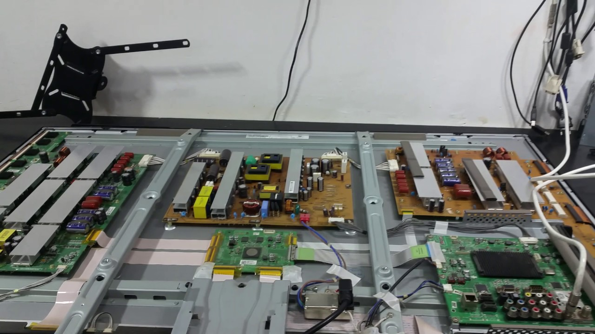
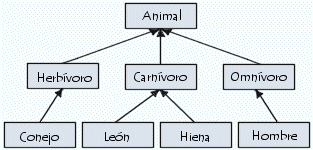
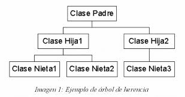
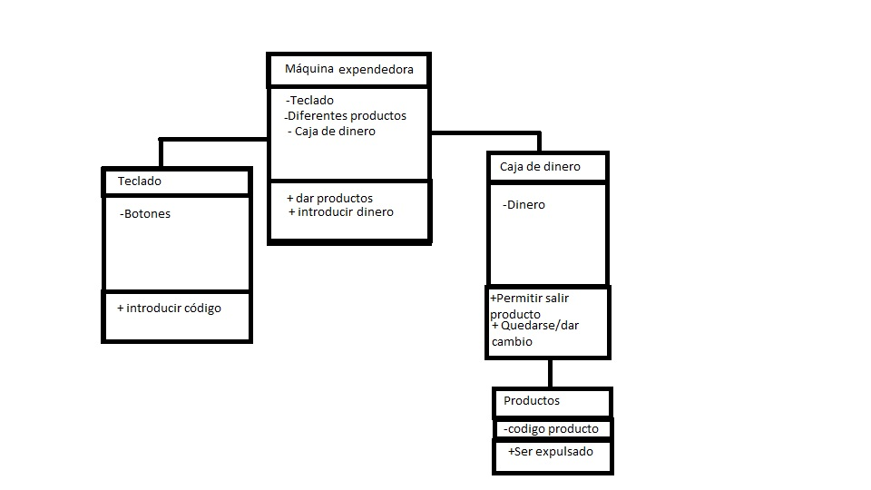

# Tarea-1
 
POO
Con tus palabras, pero investigando define los siguientes conceptos:

1. **Paradígma**: Es una técnica que se tiene para poder resolver los problemas que se vayan presentando al programar,  consiste en la unión de objetos, que son esos objetos y saber con que otros mas puede interactuar a su vez.

2. **Abstracción**, da dos ejemplos.

Son las características mas generales  que tiene un objeto en una clase sin meterse tan a fondo en la explicación.

Ejemplo 1: al buscar abstracción en algo como la clase Ave, se va a buscar caracteristicas generales que todos las aves tengan como :
pico, alas, color , tamaño , etc.

Ejemplo 2: de igual manera al buscar en la clase bicicleta, vemos que todas tienen cosas como :
Color, marca , etc.

3. **¿Por qué decimos que la Clase es el mecanismo de abstracción de los lenguajes OO?**
 Porque al crear la clase tendremos informacion en forma de parámetros que viene siendo la informacion y las caracteristicas generales de un objeto.

4. **Explica el concepto de encapsulamiento, busca dos imágenes que te ayuden a describir el concepto, una que tenga algún sistema sin encapsulamiento y otra donde si lo tenga. Menciona por que es importante y que problemas puede evitar.** 

El encapsulamiento viene siendo el aislar los datos para que solo sean visibles para el creador y que sea a prueba de cambios de el usuario y que solamente se puedan hacer los cambios mediante los métodos asociados.
Gracias a esto se pueden evitar problemas como que descomponga el programa o borre cosas que no deben ser borradas, un ejemplo son las televisiones, estan en el concepto de encapsulamiento ya que nosotros los usuarios solo vemos una pantalla y botones y solo se puede manipular con los *métodos* que ellos nos permiten, en cambio si no estuviera encapsulada veriamos todos los componentes y podriamos hacer cambios que harian que quizá se descomponga la televisión.

  

  

5. **Describe con tus palabras el concepto de herencia e ilustra el concepto con imágenes.**

Herencia es el pasarse los valores de una clase hacia otra y asi poder utilizarse en diferentes métodos.

   
   

   1. **Investiga la historia y haz un resumen del Lenguaje de Modelado Unificado, donde se mencione: quienes son sus principales autores (Booch, Rumbaugh, Jacobson), en que tipo de sistemas se utiliza, en particular el Diagrama de Clases. Menciona algunas de las herramientas para el modelado en UML. ¿Sabes de alguna empresa local que utilice este lenguaje?**

   **Grady Booch** 27 de febrero de 1955 es un diseñador de software, un metodologista de software y entusiasta del diseño de patrones. Es director científico de Rational Software (ahora parte de IBM) y editor de una serie de Benjamin/Cummings. En 1995 se recibió como miembro de la Asociación de Maquinaria Computacional (ACM). Fue nombrado socio de IBM en 2003.

   Es más conocido por el desarrollo del Lenguaje Unificado de Modelado (UML), junto con Ivar Jacobson y James Rumbaugh. También desarrolló el método Booch de desarrollo de software, el que presenta en su libro Análisis y diseño orientado a objetos. Él aconseja la adición de más clases para simplificar códigos complejos.

   **James Rumbaugh** 22 de agosto de 1947 es un científico de la computación y un metodologista de objeto. Es más conocido por su trabajo en la creación de la Técnica de Modelado de Objetos y el Lenguaje Unificado de Modelado (UML). Doctorado en ciencias de la computación por el M.I.T. Rumbaugh dirigió el desarrollo de la metodología OMT, en el Centro de Investigación y Desarrollo de la General Electric, donde trabajó durante más de 25 años. Se unió a Rational Software en 1994, y trabajó allí con Ivar Jacobson y Grady Booch ("los Tres Amigos") para desarrollar UML. Más tarde fusionaron sus metodologías de desarrollo de software, OMT, OOSE y Booch en el Proceso Unificado Racional (RUP). En el 2003 se trasladó a IBM, después de su adquisición de Rational Software. Se retiró en 2006.

  **Ivar Hjalmar Jacobson** 2 de septiembre 1939, Ystad, es un ingeniero sueco en Ciencias de la computación. Inventó el diagrama de secuencia y desarrolló los diagramas de colaboración. También impuso el uso de diagramas de estado de transición para describir los flujos de mensajes entre los componentes. Fue uno de los desarrolladores originales del SDL (lenguaje de especificación), que se convirtió en estándar en 1967.

  El Lenguaje Unificado de Modelado (UML) fue creado para forjar un lenguaje de modelado visual común y semántica y sintácticamente rico para la arquitectura, el diseño y la implementación de sistemas de software complejos, tanto en estructura como en comportamiento. UML tiene aplicaciones más allá del desarrollo de software, p. ej., en el flujo de procesos en la fabricación. Es comparable a los planos usados en otros campos y consiste en diferentes tipos de diagramas. En general, los diagramas UML describen los límites, la estructura y el comportamiento del sistema y los objetos que contiene.
  UML no es un lenguaje de programación, pero existen herramientas que se pueden usar para generar código en diversos lenguajes usando los diagramas UML. UML guarda una relación directa con el análisis y el diseño orientados a objetos.

  Lo fundamental de una herramienta UML: 

  La capacidad de diagramación, y los diferentes tipos de diagramas que soporta la herramienta
  Documentación
  Construcción
  Implantación de sistema
  Flexibilidad para admitir cambios no previstos durante el diseño o el rediseño

  y no conosco ninguna empresa.

2. **Escribe una propuesta de una máquina que venda distintos artículos y haz el diagrama de clases del sistema que propones.**

Rojas Garcia Kevin Argenis #18212263
Programación orientada a objetos
Profesor Mariosky